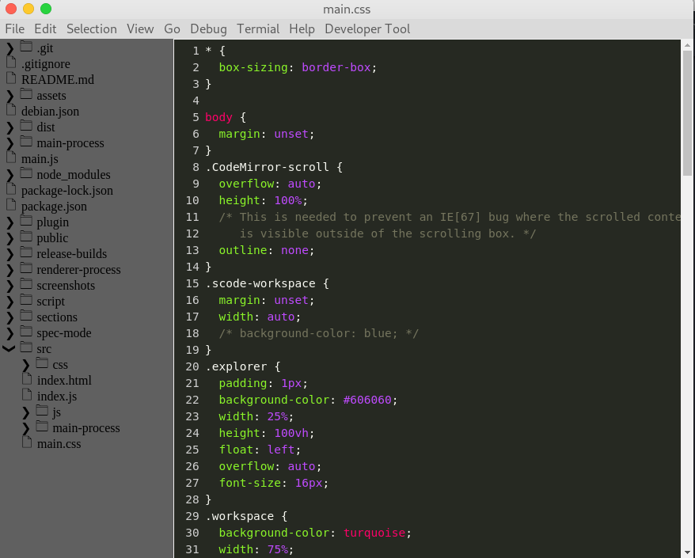

# SCabin

Demonstration



How to run your application

```git
$ git clone git@github.com:littlemonster00/SCabin.git
$ cd SCabin && npm install
$ npm start
```

## How to build and installer for debain distro

```git
$ npm run package-linux
$ npm run create-debian-installer
```

And you can run .deb file in release-builds/
